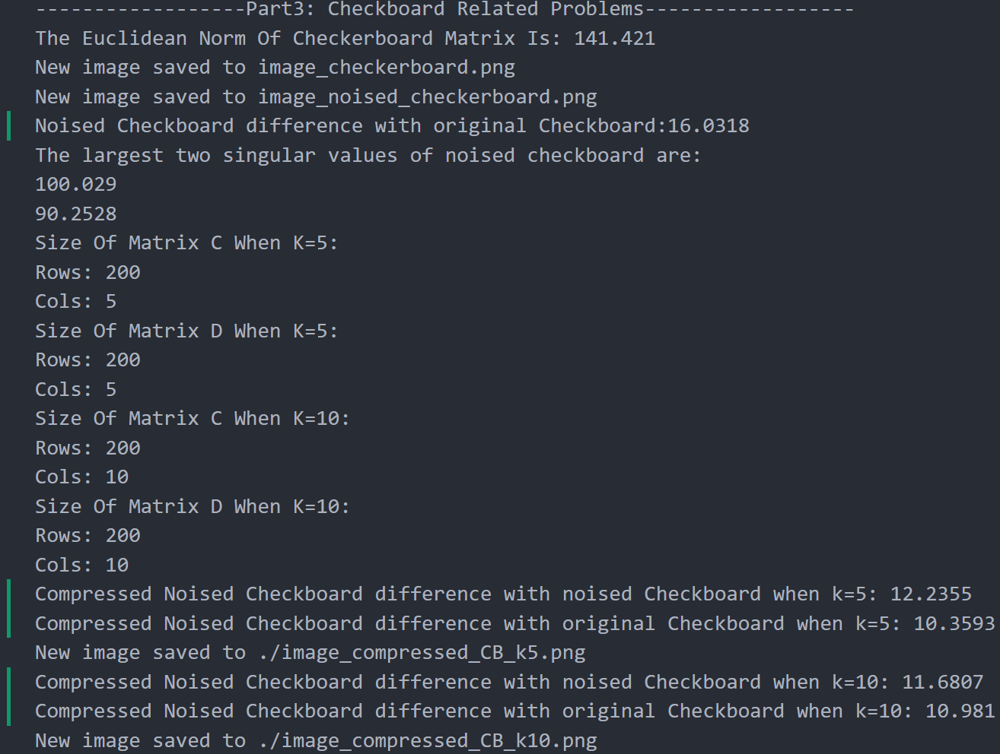

# NLA Challenge2 Results Group 6

## Output Files

- [`output.txt`](output.txt): Contains the output resultls of the main cpp program.
- [`output_lis.txt`](output_lis.txt) : Contains the output results from lis for computing the largest eigenvalue of $A^TA$.

- [`output_lis_shift.txt`](output_lis_shift.txt) : Contains the output results from lis about solving the smallest eigenvalue of $(A-\mu I)^T(A-\mu I)$ which also means solving largest eigenvalue of $A^TA$ by shifting for acceleration
  - $\mu = 1.608300e+04$
  - $\text{Inverse: number of iterations} = 3$
  - $\text{Inverse: eigenvalue} = 1.608332e+04$
- Some other files like  `AllEigenvaluesOfATA.txt`, `MatrixSigma.mtx`, `SingularValuesOfA.txt` ... are used for own checking.

## Some Comments

About the last question, we can see that by this compressed way through svd, we have decreased the noise difference from 16 to about 12 successfully.

- however, it seems when $k=10$ the compressed image compared to the original one is less denoised that the case for $k=5$
- it is because the large the eigenvalue is, the most relevant information is kept. And the noised parts are not so relevant and domained factors. So, we have better approximation to original image when we keep the largest few eigenvalues like 5.

## Answers Draft

Here are answers to the questions in the challenge:

- **Question1:** _Euclidean Norm Of ATA Is: 16154_
- **Question2:** Then, the two largest singular values of A are: 126.82 and 37.3455.
- **Question3:** Report the computed eigenvalue from lis: Power: eigenvalue = 1.608332e+04; Power: number of iterations = 8
- **Question4:** Report $\mu$ and the number of iterations: shift: 1.608300e+04; Inverse: number of iterations = 3
- **Question5:** Report the Euclidean norm of the diagonal matrix $\Sigma$ of the singular values: Euclidean norm of the diagonal matrix sigma:139.516.
- **Question6:**
  - Nonzero Entries For Matrix C40: 13640
  - Nonzero Entries For Matrix D40: 10240
  - Nonzero Entries For Matrix C80: 27280
  - Nonzero Entries For Matrix D80: 20480
- **Question7:** two images.
- **Question8:** Report the Euclidean norm of the matrix corresponding to the image: The Euclidean Norm Of Checkerboard Matrix Is: 141.421.
- **Question9:** noised_checkerboard.png
- **Question10:** Report the two largest computed singular values: 100.029, 90.2528
- **Question11:** Report the size of the matrices C and D.
  Size Of Matrix C When K=5:
  Rows: 200
  Cols: 5
  Size Of Matrix D When K=5:
  Rows: 200
  Cols: 5
  Size Of Matrix C When K=10:
  Rows: 200
  Cols: 10
  Size Of Matrix D When K=10:
  Rows: 200
  Cols: 10
- **Question12:** two images.
- **Question13:** Compare the compressed images with the original and noisy images. Comment the results.